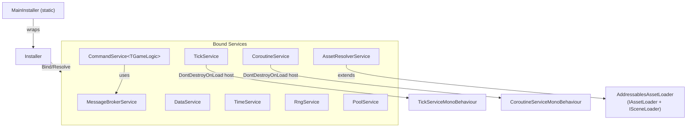

# GameLovers.Services - AI Agent Guide

> **Companion files**: `CLAUDE.md` wraps this file for Claude Code — edit `AGENTS.md`, not `CLAUDE.md`. `README.md` is the user-facing entry point; `docs/` has deep per-service API references.

## 1. Package Overview
- **Package**: `com.gamelovers.services`
- **Unity**: 6000.0+
- **Dependencies** (see `package.json` — versions here must stay in sync)
  - `com.gamelovers.gamedata` (**1.0.0**) — provides `floatP`, used by `RngService`
  - `com.unity.addressables` (**1.21.20**) — asset loading and scene loading
  - `com.cysharp.unitask` (**2.5.10**) — async/await support for asset loading

This package provides a set of small, modular "foundation services" for Unity projects (service locator/DI-lite, messaging, ticking, coroutines, pooling, persistence, RNG, time, command pattern, and build version helpers) plus Addressables-based asset loading and importing tooling (absorbed from `com.gamelovers.assetsimporter` v0.5.2 in v2.0.0).

**Audience**: This file is for contributors/agents working on the package. For user-facing docs, see `README.md` (quick start, per-service examples) and `docs/` (full API reference).

## 2. Runtime Architecture (high level)

### Interface-to-Concrete Lookup

| Interface | Namespace | Implementation | File |
|-----------|-----------|---------------|------|
| `IInstaller` | `GameLovers.Services` | `Installer` | `Runtime/DependencyInjection/Installer.cs` |
| `IMessageBrokerService` | `GameLovers.Services` | `MessageBrokerService` | `Runtime/MessageBrokerService.cs` |
| `ITickService` | `GameLovers.Services` | `TickService` | `Runtime/TickService.cs` |
| `ICoroutineService` | `GameLovers.Services` | `CoroutineService` | `Runtime/CoroutineService.cs` |
| `IPoolService` | `GameLovers.Services.Pooling` | `PoolService` (ns `GameLovers.Services`) | `Runtime/Pooling/IPoolService.cs`, `Runtime/PoolService.cs` |
| `IObjectPool<T>` | `GameLovers.Services.Pooling` | `ObjectPool<T>`, `GameObjectPool`, `GameObjectPool<T>` | `Runtime/Pooling/` |
| `IDataProvider` / `IDataService` | `GameLovers.Services` | `DataService` | `Runtime/DataService.cs` |
| `ITimeService` / `ITimeManipulator` | `GameLovers.Services` | `TimeService` | `Runtime/TimeService.cs` |
| `IRngService` | `GameLovers.Services` | `RngService` | `Runtime/RngService.cs` |
| `ICommandService<TGameLogic>` | `GameLovers.Services.Commands` | `CommandService<TGameLogic>` (ns `GameLovers.Services`) | `Runtime/Commands/ICommandService.cs`, `Runtime/CommandService.cs` |
| `IGameCommand<TGameLogic>` / `IGameServerCommand<TGameLogic>` | `GameLovers.Services.Commands` | *(user-defined commands)* | `Runtime/Commands/IGameCommand.cs` |
| `IAssetLoader` | `GameLovers.Services.AssetsImporter` | `AddressablesAssetLoader` | `Runtime/AssetsImporter/AddressablesAssetLoader.cs` |
| `ISceneLoader` | `GameLovers.Services.AssetsImporter` | `AddressablesAssetLoader` | `Runtime/AssetsImporter/AddressablesAssetLoader.cs` |
| `IAssetResolverService` / `IAssetAdderService` | `GameLovers.Services` | `AssetResolverService` | `Runtime/AssetResolverService.cs` |

### Service Locator / Bindings
`Runtime/Installer.cs`, `Runtime/MainInstaller.cs`
- `Installer` stores a `Dictionary<Type, object>` of interface type → instance.
- `MainInstaller` is a **static** wrapper over a single `Installer` instance (global scope).
- Binding is **instance-based** (`Bind<T>(T instance)`), not "type-to-type" or lifetime-managed DI.
- Only **interfaces** can be bound (binding a non-interface throws `ArgumentException`).
- `Installer.Bind<T, T1, T2>(instance)` binds one instance to two interfaces simultaneously. `Installer.Bind<T, T1, T2, T3>(instance)` also exists for three interfaces. `MainInstaller` only exposes single-interface `Bind<T>`.
- `Bind` calls are chainable (returns `IInstaller`).
- Re-binding the same interface throws (`Dictionary.Add` — no overwrite semantics).

### Messaging
`Runtime/MessageBrokerService.cs`
- Message contract: `IMessage`
- Pub/sub via `IMessageBrokerService`:
  - `Publish<T>(T message)` — iterates subscribers directly; throws if `Subscribe`/`Unsubscribe` is called during publish.
  - `PublishSafe<T>(T message)` — copies delegate list first; safe for chain subscribe/unsubscribe during publish (allocates).
  - `Subscribe<T>(Action<T> action)` — keyed by `action.Target`; **static methods throw**.
  - `Unsubscribe<T>(object subscriber = null)` — `null` removes **all** subscribers for that type.
  - `UnsubscribeAll(object subscriber = null)` — `null` clears **everything**.

### Tick / Update Fan-Out
`Runtime/TickService.cs`
- Creates a `DontDestroyOnLoad` GameObject with `TickServiceMonoBehaviour` to drive Unity callbacks.
- Subscriber API (all take `Action<float> action`):
  - `SubscribeOnUpdate(action, deltaTime=0f, timeOverflowToNextTick=false, realTime=false)`
  - `SubscribeOnLateUpdate(action, deltaTime=0f, timeOverflowToNextTick=false, realTime=false)`
  - `SubscribeOnFixedUpdate(action)`
  - `Unsubscribe(action)` — removes from all lists
  - `UnsubscribeOnUpdate/OnFixedUpdate/OnLateUpdate(action)` — type-specific single removal
  - `UnsubscribeAllOnUpdate()` / `UnsubscribeAllOnUpdate(object)` — bulk clear Update list (all or by subscriber)
  - `UnsubscribeAllOnFixedUpdate()` / `UnsubscribeAllOnFixedUpdate(object)` — bulk clear FixedUpdate list
  - `UnsubscribeAllOnLateUpdate()` / `UnsubscribeAllOnLateUpdate(object)` — bulk clear LateUpdate list
  - `UnsubscribeAll()` / `UnsubscribeAll(object subscriber)` — clears all lists (all or by subscriber)
- `deltaTime > 0` enables buffered ticking (rate-limited). `timeOverflowToNextTick` carries overflow to reduce drift.
- `realTime=true` uses `Time.realtimeSinceStartup`; `false` (default) uses `Time.time`.

### Coroutine Host
`Runtime/CoroutineService.cs`
- Creates a `DontDestroyOnLoad` GameObject with `CoroutineServiceMonoBehaviour`.
- API:
  - `StartCoroutine(IEnumerator)` → `Coroutine` (plain Unity handle, no callbacks)
  - `StartAsyncCoroutine(IEnumerator)` → `IAsyncCoroutine` (has `OnComplete(Action)`, `IsRunning`, `IsCompleted`, `StopCoroutine(bool)`)
  - `StartAsyncCoroutine<T>(IEnumerator, T data)` → `IAsyncCoroutine<T>` (adds `Data` and `OnComplete(Action<T>)`)
  - `StartDelayCall(Action call, float delay)` → `IAsyncCoroutine` — argument order: action first, delay second
  - `StartDelayCall<T>(Action<T> call, T data, float delay)` → `IAsyncCoroutine<T>`
  - `StopCoroutine(Coroutine)`, `StopAllCoroutines()`

### Pooling
`Runtime/PoolService.cs`, `Runtime/ObjectPool.cs`
- Pool registry: `PoolService : IPoolService` — one pool per type.
- Pool implementations:
  - `ObjectPool<T>` — generic; lifecycle hooks via direct cast (`IPoolEntitySpawn`, `IPoolEntityDespawn`)
  - `GameObjectPool` — `GameObject` pools; lifecycle hooks via `GetComponent<>()`; manages `SetActive`
  - `GameObjectPool<T> where T : Behaviour` — component-typed; same `GetComponent<>()` hook pattern
- `IObjectPool<T>` surface: `Spawn()`, `Spawn<TData>(data)`, `Despawn(entity)`, `Despawn(bool onlyFirst, Func<T,bool>)`, `DespawnAll()`, `Reset(uint, T)`, `Clear()`, `SampleEntity`, `SpawnedReadOnly`
- Lifecycle hook interfaces: `IPoolEntitySpawn`, `IPoolEntitySpawn<T>`, `IPoolEntityDespawn`, `IPoolEntityObject<T>`
- `CallOnSpawned`/`CallOnDespawned` are **virtual** in `ObjectPoolBase<T>` — override to customize lifecycle dispatch.

### Persistence
`Runtime/DataService.cs`
- `IDataProvider` — read-only interface: `GetData<T>()`, `HasData<T>()`
- `IDataService : IDataProvider` — full interface: adds `AddOrReplaceData<T>(T)`, `LoadData<T>()`, `SaveData<T>()`, `SaveAllData()`
- In-memory store keyed by `Type` (not string). Only **reference types** (`where T : class`) supported.
- Disk persistence via `PlayerPrefs` + `Newtonsoft.Json` serialization. Key = `typeof(T).Name`.

### Time + Manipulation
`Runtime/TimeService.cs`
- `ITimeService` — read-only: `DateTimeUtcNow`, `UnityTimeNow`, `UnityScaleTimeNow`, `UnixTimeNow`, plus conversion methods.
- `ITimeManipulator : ITimeService` — adds `AddTime(float)`, `SetInitialTime(DateTime)`.
- `TimeService` implements `ITimeManipulator`. Bind as `ITimeManipulator` for write access; `ITimeService` for read-only consumers.

### Deterministic RNG
`Runtime/RngService.cs`
- `RngData` / `IRngData` — state container (Seed, Count, State array).
- `IRngService` API: `Next`, `Nextfloat`, `Peek`, `Peekfloat`, `PeekRange(...)`, `Range(...)`, `Restore(int count)`, `Counter`, `Data`
- `RngService.CreateRngData(int seed)` — static factory for `RngData`.
- Float API uses `floatP` from `com.gamelovers.gamedata`.

### Command Pattern
`Runtime/CommandService.cs`
- Command contract: `IGameCommand<TGameLogic>` with `void Execute(TGameLogic, IMessageBrokerService)`.
- Server-only variant: `IGameServerCommand<TGameLogic>` with `void ExecuteLogic(TGameLogic)`.
- Service: `ICommandService<TGameLogic>` → `CommandService<TGameLogic>(TGameLogic, IMessageBrokerService)`.
- `CommandService` exposes `protected TGameLogic GameLogic` and `protected IMessageBrokerService MessageBroker` for subclassing (added in v0.15.1).
- Execution is **synchronous**. Use struct commands for fire-and-forget; class commands for reference semantics.

### Build/Version Info
`Runtime/VersionServices.cs`
- Static class. Requires `version-data` TextAsset in Resources.
- `LoadVersionDataAsync()` — async; call once at startup.
- `VersionExternal` — safe at any time (reads `Application.version`).
- `VersionInternal`, `Branch`, `Commit`, `BuildNumber` — **throw** if called before `LoadVersionDataAsync()` completes.

## 3. Key Directories / Files

- **Runtime**: `Runtime/`
  - Entry points: `Runtime/DependencyInjection/Installer.cs`, `Runtime/DependencyInjection/MainInstaller.cs`
  - Foundation services (ns `GameLovers.Services`): `MessageBrokerService.cs`, `TickService.cs`, `CoroutineService.cs`, `PoolService.cs`, `DataService.cs`, `TimeService.cs`, `RngService.cs`, `VersionServices.cs`, `CommandService.cs`, `AssetResolverService.cs`
  - Command contracts (ns `GameLovers.Services.Commands`, in `Commands/`): `IGameCommand.cs`, `ICommandService.cs`
  - Pool contracts + implementations (ns `GameLovers.Services.Pooling`, in `Pooling/`): `IPoolService.cs`, `IObjectPool.cs`, `IPoolEntity.cs`, `ObjectPool.cs`, `GameObjectPool.cs`
  - Asset loading contracts + implementations (ns `GameLovers.Services.AssetsImporter`, in `AssetsImporter/`): `IAssetLoader.cs`, `ISceneLoader.cs`, `AddressablesAssetLoader.cs`, `AddressableConfig.cs`, `AssetConfigsScriptableObject.cs`, `AssetLoaderUtils.cs`, `AssetReferenceScene.cs`
- **Editor**: `Editor/` — all code here is editor-only; do not reference from runtime assemblies
  - `Editor/Versioning/` (ns `GameLovers.Services.Versioning.Editor`): `VersionEditorUtils.cs`, `GitEditorProcess.cs` — version-data generation (runs on editor load + before builds)
  - `Editor/AssetsImporter/` (ns `GameLovers.Services.AssetsImporter.Editor`): `AssetsImporter.cs`, `AssetsToolImporter.cs`, `AssetConfigsImporter.cs`, `AddressableIdsGenerator.cs`, `AddressablesIdGeneratorSettings.cs` — asset import pipeline
  - Assembly: `GameLovers.Services.Editor.asmdef`
- **Tests**: `Tests/`
  - Before reading, editing, or creating any file in `Tests/`, you **MUST** read [`Tests/AGENTS.md`](Tests/AGENTS.md) first.

  | Folder | Mode | What lives here |
  |--------|------|----------------|
  | `EditMode/Unit/` | EditMode | NUnit + NSubstitute; all non-MonoBehaviour services + AssetResolver/AssetLoaderUtils |
  | `EditMode/Performance/` | EditMode | ObjectPool, MessageBroker perf (`Unity.PerformanceTesting`) |
  | `PlayMode/Unit/` | PlayMode | TickService, CoroutineService, GameObjectPool, GameObjectPool\<T\> |
  | `PlayMode/Integration/` | PlayMode | ServiceLifecycle, VersionServices, AddressablesAssetLoader (marked `[Explicit]`) |
  | `PlayMode/Performance/` | PlayMode | TickService, GameObjectPool perf |
  | `PlayMode/Smoke/` | PlayMode | `ServicesBootstrapSmokeTest` |

### Folder Namespace Mapping

With `"rootNamespace": "GameLovers.Services"` on the asmdef, Unity's *Create > C# Script* auto-derives namespaces from folder paths. That is already correct for all subfolders **except** `DependencyInjection/`.

| Folder | Namespace | Notes |
|---|---|---|
| `Runtime/` (root) | `GameLovers.Services` | Concrete `*Service` classes + `AssetResolverService` |
| `Runtime/DependencyInjection/` | `GameLovers.Services` | **Carve-out** — new files here need manual namespace fix (strip `DependencyInjection` segment) |
| `Runtime/Commands/` | `GameLovers.Services.Commands` | Command contracts (interfaces only) |
| `Runtime/Pooling/` | `GameLovers.Services.Pooling` | Pool contracts + pool implementations |
| `Runtime/AssetsImporter/` | `GameLovers.Services.AssetsImporter` | Asset loading interfaces + Addressables loader |

The concrete `PoolService` stays in `Runtime/` root under `GameLovers.Services` but references types from `GameLovers.Services.Pooling` — the file declares `using GameLovers.Services.Pooling;` at the top. `CommandService` follows the same pattern with `using GameLovers.Services.Commands;`.

## 4. Important Behaviors / Gotchas

### MainInstaller API
- `MainInstaller` exposes only single-interface `Bind<T>`. Multi-interface `Bind<T, T1, T2>` is on `IInstaller`/`Installer` directly.
- There is no `MainInstaller.Instance` — it is a static class wrapping a private `Installer`.

### Message Broker Mutation Safety
- `Publish<T>` iterates subscribers directly; calling `Subscribe`/`Unsubscribe` during publish **throws**.
- Use `PublishSafe<T>` if handlers may subscribe/unsubscribe during message handling (copies delegates first, at allocation cost).
- `Subscribe` uses `action.Target` as key — **static method subscriptions throw `ArgumentException`**.

### Tick / Coroutine Host GameObjects
- `TickService` and `CoroutineService` each create a `DontDestroyOnLoad` GameObject. Call `Dispose()` to tear them down (tests, game reset, domain reload).
- These services do **not** enforce a singleton; constructing multiple instances creates multiple host GameObjects.

### IAsyncCoroutine.StopCoroutine(triggerOnComplete)
- The current implementation always triggers completion callbacks regardless of the `triggerOnComplete` flag (parameter is not respected). Do not rely on cancellation-without-callback semantics.

### DataService Persistence
- Keys in `PlayerPrefs` are `typeof(T).Name` — name collisions are possible across assemblies with types sharing the same name.
- `LoadData<T>` uses `Activator.CreateInstance<T>()` when no saved data exists; `T` must have a **parameterless constructor**.
- Only reference types (`class`) are supported; value types (`struct`) are not.

### Pool Lifecycle
- `PoolService` keeps **one pool per type**; `AddPool<T>()` will throw (`Dictionary.Add`) if the type is already registered.
- `GameObjectPool.Dispose(bool disposeSampleEntity)` destroys the `SampleEntity` GameObject when `true`. `GameObjectPool.Dispose()` destroys all pooled instances but not the sample reference.
- `GameObjectPool` / `GameObjectPool<T>` use `GetComponent<>()` for lifecycle hooks on components. `ObjectPool<T>` casts the entity directly. This determines where `IPoolEntitySpawn` etc. must be implemented.

### Asset Loading (AddressablesAssetLoader)
- `UnloadAssetAsync<T>` calls `GC.Collect()` + `Resources.UnloadUnusedAssets()` — aggressive for a library call. This is preserved as-is from the original implementation; avoid adding similar patterns in new code.
- `AddressablesAssetLoader` implements both `IAssetLoader` and `ISceneLoader`. `AssetResolverService` extends it and sits in the root `GameLovers.Services` namespace while its dependencies live in `GameLovers.Services.AssetsImporter`.
- `AssetResolverService.RequestAsset` and `LoadSceneAsync<TId>` require assets to be pre-registered via `AddConfigs` / `AddAssets` / `AddAsset` (throws `MissingMemberException` otherwise).
- `AssetConfigsScriptableObject<TId,TAsset>` inherits `AssetConfigsScriptableObjectBase<TId, AssetReference>` (not `<TId, TAsset>`). The generic `TAsset` is captured only as `AssetType`. This is intentional for the Addressables weak-link pattern.

### AssetsConfigsImporter (Editor)
- The `TId` type parameter on `AssetsConfigsImporter<TId,TAsset,TScriptableObject>` must satisfy `where TId : Enum`. Passing a non-enum identifier type will not compile.
- Editor-heavy methods (`AssetsConfigsImporter.Import`, `AddressableIdsGenerator.GenerateAddressableIds`) are intentionally not covered by automated tests — they require `AssetDatabase` access and are validated manually via the Unity Editor Tools menu.

### CommandService Inheritance
- `CommandService<TGameLogic>` has `protected TGameLogic GameLogic` and `protected IMessageBrokerService MessageBroker` accessible in subclasses.
- `ExecuteCommand` is not declared `virtual`; to intercept execution, subclass and shadow with `new`, or implement `ICommandService<TGameLogic>` directly.

### Version Data Pipeline
- Runtime expects a Resources TextAsset named `version-data` (`VersionServices.VersionDataFilename`).
- `VersionEditorUtils` writes `Assets/Configs/Resources/version-data.txt` on editor load and can be invoked before builds. It uses git CLI; failures should be handled gracefully.
- `VersionExternal` is always safe (reads `Application.version` directly). All other `VersionServices` accessors throw if data has not been loaded — call `LoadVersionDataAsync()` early in boot.

### Error Quick-Reference

| Call | Exception | Condition |
|------|-----------|-----------|
| `Installer.Bind<T>(instance)` | `ArgumentException` | `T` is not an interface |
| `Installer.Bind<T>(instance)` (duplicate) | `ArgumentException` | `T` already bound |
| `MainInstaller.Resolve<T>()` | `KeyNotFoundException` | `T` not bound |
| `broker.Subscribe(staticMethod)` | `ArgumentException` | `action.Target` is null |
| `broker.Publish<T>()` | Exception | `Subscribe`/`Unsubscribe` called during iteration |
| `dataService.GetData<T>()` | `KeyNotFoundException` | `T` not loaded or added |
| `dataService.LoadData<T>()` | `MissingMethodException` | `T` has no parameterless constructor |
| `poolService.AddPool<T>(pool)` (duplicate) | `ArgumentException` | Pool for `T` already registered |
| `VersionServices.*` (except `VersionExternal`) | `NullReferenceException` | `LoadVersionDataAsync()` not called |
| `assetResolverService.RequestAsset<TId,TAsset>()` | `MissingMemberException` | Asset/scene not registered via `AddAssets` |
| `assetResolverService.LoadSceneAsync<TId>()` | `MissingMemberException` | Scene not registered via `AddAssets` |

## 5. Coding Standards (Unity 6 / C# 9.0)
- **C#**: C# 9.0 syntax; explicit namespaces; no global usings.
- **Assemblies**
  - Runtime must not reference `UnityEditor`.
  - Editor tooling must live under `Editor/` (or be guarded with `#if UNITY_EDITOR` if absolutely necessary).
- **Performance**
  - Be mindful of allocations in hot paths (e.g., `PublishSafe` allocates; tick lists mutate; avoid per-frame allocations).

## 6. External Package Sources (for API lookups)
Prefer local UPM cache / local packages when needed:
- GameData (`floatP`, `MathfloatP`): `Packages/com.gamelovers.gamedata/`
- Unity Newtonsoft JSON: check `Library/PackageCache/` if you need source details
- Unity Addressables API: `Library/PackageCache/com.unity.addressables@<version>/`
- UniTask API: `Library/PackageCache/com.cysharp.unitask@<version>/`

## 7. Package Dev Workflows (common changes)

### Add a new service
- Add runtime interface + implementation under `Runtime/` (keep UnityEngine usage minimal if possible).
- Add/adjust tests under `Tests/`.
- If the service needs Unity callbacks, follow the `TickService`/`CoroutineService` pattern (single `DontDestroyOnLoad` host object + `Dispose()`).

### Add a new command
- Define a struct (sync, fire-and-forget) or class implementing `IGameCommand<TGameLogic>`.
- Implement `void Execute(TGameLogic gameLogic, IMessageBrokerService messageBroker)`.
- Add unit tests under `Tests/EditMode/Unit/CommandServiceTest.cs`.

### Update versioning
- Ensure `version-data.txt` exists/updates correctly in `Assets/Configs/Resources/`.
- If changing `VersionServices.VersionData`, update both runtime parsing and `VersionEditorUtils` writing logic.

## 8. Update Policy
Update this file when:
- The binding/service-locator API changes (`Installer`, `MainInstaller`)
- Core service behavior changes (publish safety rules, tick timing, coroutine completion/cancellation semantics, pooling lifecycle, command execution)
- Asset loading / import pipeline behavior changes (`AssetResolverService`, `AddressablesAssetLoader`)
- Versioning pipeline changes (resource filename, editor generator behavior, runtime parsing)
- Dependencies change (`package.json`, new external types like `floatP`)
- New services are added
- Folder layout or namespace mapping changes (update §3 Folder Namespace Carve-Outs)
